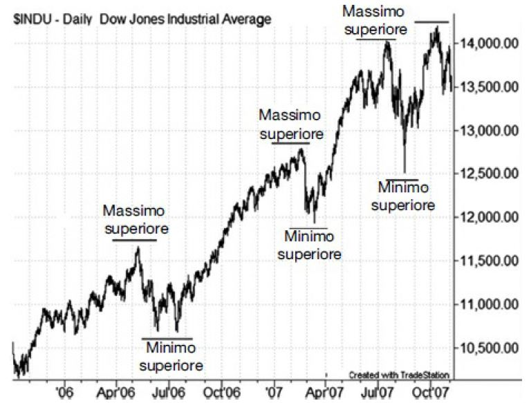

# Guida Completa al Trading - by Corey Rosenbloom
## Trend
Tendenza diffusa, da parte del prezzo di un'azione o di un mercato, di muoversi nella stessa direzione nel corso del tempo.
I trend possono essere di lungo, medio, o breve termine e si dividono in:
-   _ascendente_ = sequenza di massimi / minimi relativi crescenti (_swing rialzista_)
-   _discendente_ = sequenza di massimi / minimi discendenti (_swing ribassista_)

Una volta consolidato **ha più probabilità di continuare che di invertirsi**. D'altro canto, un trend non può durare per sempre, perchè **l'andamento ciclico del mercanto non si arresta mai**.
L'obiettivo dovrebbe sempre essere l'individuazione della _struttura del trend_ e al contempo di saper cogliere i _segnali di inversione_ di un trend maturo.

### Metodi di definizione del trend
#### Teoria di Dow
Charles Dow notò che per essere valido 
- un trend ascendente doveva avere un massimo superiore e un minimo superiore ed il volume che aumenta nelle fasi di incremento del prezzo e diminuisce nelle fasi di correzione al ribasso
- un trend discendente doveva avere un massimo inferiore e un minimo inferiore ed il volume che aumenta nelle fasi di diminuzione del prezzo e diminuisce nelle fasi di correzione al rialzo
#### Metodo del prezzo puro
Individuare massimi e minimi relativi, confrontando al contempo i massimi e i minimi precedenti con quelli più recenti.
**L'individuazione degli swing**, tuttavia non è banale. Quello che si intende per swing **dipende dall'orizzonte temporale** che si sta analizzando. Su un grafico intraday a 5 minuti uno swing potrebbe durare 30 minuti, su uno giornaliero da settimane a mesi, su uno settimanale da alcuni mesi a un anno.

Nei grafici giornalieri si possono utilizzare i seguenti parametri:

**Variazione % prezzo**
- minore 5% è probabilmente troppo poco
- 5% - 15% è il riferimento più attendibile
- maggiore 15% è probabilmente troppo

**Durata o giorni**
- minore 1 mese è probabilmente troppo poco
- 1-6 mesi è il riferimento più attendibile
- maggiore 6 mesi è probabilmente troppo

### Inversioni del trend

Il prezzo deve completare un processo specifico perchè si possa dichiarare l'inversione di un trend. Con il metodo del prezzo puro ci sono due modi:

- prezzo, partendo da un massimo (M1), forma un primo minimo inferiore (m1), poi un massimo inferiore (M2 < M1) e poi riscende sotto  m1
- prezzo, partendo da un massimo (M1), forma un massimo inferiore (M2 < M1) e poi scende sotto al minimo precedente. Per un'ulteriore conferma si può attendere la formazione del minimo e di un  nuovo massimo inferiore (M3 < M2)

Il  secondo caso ha un punto di inversione aggressivo ed un secondo più prudente. Questo significa che **la conferma ha sempre un costo**.

<FIG_1_3>

### Metodo della media mobile

Il metodo della media mobile utilizza una media mobile di breve (20 periodi), medio (50 periodi), lungo (200 periodi) termine per valutare la struttura del trend.
Il periodo dipende dal grafico, un giorno su un grafico giornaliero, una settimana su uno settimanale, ecc.
L'**orientamento più rialzista** si ha quando il prezzo è sopra la media di periodo 20, la quale è maggiore di quella di periodo 50, che a sua volta è maggiore di quella di periodo 200.
L'**orientamento più ribassista** si ha invece quando il prezzo è minore della media di periodo 20, la quale è minore di quella di periodo 50, che a sua volta è minore di quella di periodo 200.
Inoltre, gli __incroci delle medie mobili__ fanno presagire delle inversioni del trend ma, come nel caso del metodo del prezzo puro, richiedono una conferma ufficiale dell'inversione.

### Medie mobili semplici ed esponenziali

La media mobile semplice (SMA) attribuisce lo stesso peso a ogni giorno, dando al prezzo di 50 giorni fa la stessa importanza rispetto al prezzo di ieri.